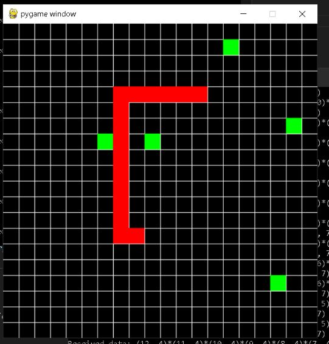

# Multiplayer Snake

A multiplayer Snake game built with Python sockets and `pygame`. One server hosts the game state and multiple clients can connect at once, each controlling their own snake on a shared grid.



## Highlights

- **Client-server architecture** — a single authoritative server runs the game loop; clients are "dumb" renderers that send input and draw whatever state they're told
- **Concurrency** — each client connection runs on its own thread on the server, alongside a separate game-tick thread, and the client itself runs separate threads for receiving state and sending heartbeats
- **Custom network protocol** — game state, moves, and chat messages are all serialized into a compact string format and parsed back out on each end
- **RSA key exchange** — server and client generate keypairs and swap public keys on connect, via the `cryptography` library
- **Tech stack**: Python, `pygame`, `socket`, `threading`, `cryptography`

## How it works

- **`snake.py`** — Core game logic: the `Cube` and `Snake` classes (movement, growth, drawing) and the `SnakeGame` class, which tracks all players and snacks on a shared grid and is used by both the server and the legacy prototype.
- **`snake_server.py`** — Authoritative multiplayer server. Accepts client connections over TCP sockets, runs the game loop on a fixed tick interval in its own thread, and broadcasts the game state to every connected client. Each client also exchanges an RSA key pair with the server on connect.
- **`snake_client.py`** — `pygame`-based client. Connects to the server, sends movement input, and renders the snakes and snacks it receives back from the server.

## Requirements

- Python 3.11+
- Dependencies listed in `requirements.txt`

Install them with:

```bash
pip install -r requirements.txt
```

## Running it

1. Start the server:

   ```bash
   python snake_server.py
   ```

2. Start one or more clients (each in its own terminal):

   ```bash
   python snake_client.py
   ```

   By default the client connects to `localhost:5555`. To play across machines on the same network, update `SERVER_IP` in `snake_client.py` and the `server` value in `snake_server.py`.

## Controls

| Key                 | Action                     |
|----------------------|----------------------------|
| Arrow keys / A / D  | Move the snake              |
| `r`                  | Reset your snake            |
| `z`, `x`, `c`        | Send a quick chat message   |
| `q`                  | Quit                        |
